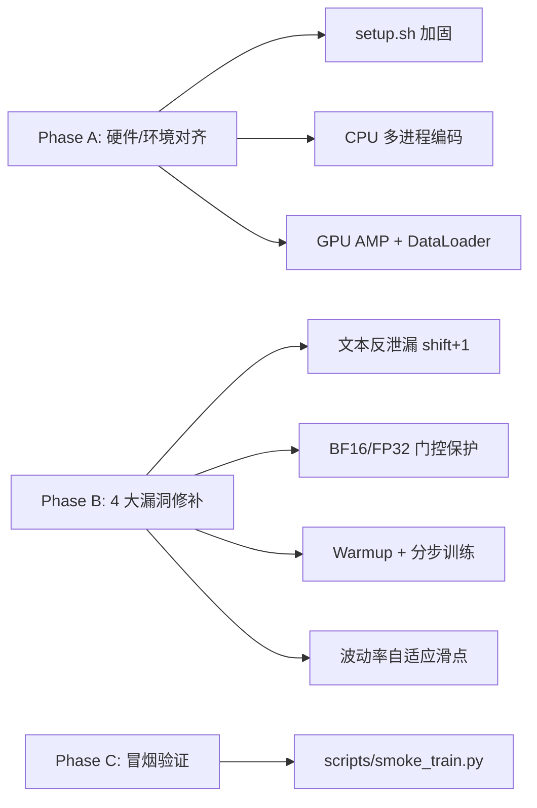

# 比特币多模态预测 — 顶刊级完整实验设计

> 目标：IEEE TKDE / TNNLS / Information Fusion / Expert Sys. App. / ICAIF
> 任务：T+{1,3} 对数收益率回归 + 涨跌方向分类 + 已实现波动率回归 + 多空量化回测
> 创新主张：**Regime-Aware Bidirectional Cross-Modal Attention (RA-BiCMA)**
> 总实验量（精简后）：唯一配置 ≈ **65**，含 3 seeds × 5 fold ≈ **1000 次 fit**，单卡 RTX 4090 每天 12h 跑约 **15–20 天**（4090 比 3090 快 ~30%），留 1–2 周写作出图，6 周内交稿
>
> **🎯 部署目标（DEPLOYMENT TARGET，所有代码必须对齐）**
>
> - **OS**：Linux（Ubuntu 20.04 / 22.04，假设 root 或 sudo 可用）
> - **GPU**：单卡 RTX 4090 (24 GB VRAM)
> - **Python**：3.10（兼容 PyTorch 2.x + transformers 4.40+）
> - **CUDA**：12.1（PyTorch 2.3 默认 wheel）
> - **网络**：服务器可直连外网 → Kaggle / HuggingFace / Yahoo / GitHub 都能直接 pull
> - **代码 Build 平台**：当前 Win 机（Cursor 写完 → 整体 zip/git → 拷到 4090）
> - **跨平台约定**：所有路径走 `pathlib.Path`、所有命令脚本写 `.sh`（不写 `.ps1`），不出现 `D:\\` / `C:\\` 之类 hardcode
> - **可执行入口**：用户在 4090 上 `git clone` 后只需 `bash setup.sh && bash scripts/download_all.sh && bash scripts/run_pipeline.sh`
>
> **精简原则（用户拍板）**：seeds 5→3 / lookback 4→2 / horizon 3→2 / 主输入组合 7→4（S2/S3/S6 单 fold 入附录）；**所有顶刊红线项 100% 保留**（M1-M12、A1-A8、E1-E3、5-Fold TSS、DM/MCS、含费率回测、可解释性）。
>
> ### 任务分类标签（贯穿全文）
>
> - 🔴 **CORE**：顶刊红线，绝对不能砍
> - 🟢 **REQUIRED**：主表必备
> - 🟡 **APPENDIX**：放附录，仅 1 fold 证明趋势

---

## 0. 论文叙事与核心创新（先定锚点，再做实验）

### 0.1 三层创新声明（顶刊评审最关心）

- **L1 — 机制层（核心）**：提出 **RA-BiCMA**。即同时计算 Num→Text 与 Text→Num 两路 Cross-Attention，并由一个 **Regime Gate**（输入：实现波动率 RV20、ATR、200日趋势）输出软权重 \alpha\in[0,1]，融合两路输出 H = \alpha H_{N\to T} + (1-\alpha) H_{T\to N}。一举解决「Num 还是 Text 当 Query 更好」的开放问题（这正是 STONK 留下的空缺）。
- **L2 — 表征层**：双源情感（Twitter 散户 + News 机构）+ 双层情感（Score 显式 + Embedding 隐式）+ 链上结构特征（NVT/SOPR/MVRV）三源协同，覆盖「市场—情绪—基本面」的金融三角。
- **L3 — 评估层**：5-Fold TimeSeriesSplit + DM 检验 + Model Confidence Set (MCS) + 含手续费的多空回测 + 制度切片 + 注意力可解释性，构建顶刊级「五维稳健性证据链」。

### 0.3 三大叙事杀手锏（B → A 类冲刺，**贯穿全文 2–3 个核心 Finding**）

> 让审稿人一眼看穿你的创新不是「又一个跨模态融合」，而是「机器学习 + 金融直觉」的耦合发现：

- **杀手锏-1（§7.4 Gate 的物理意义）**：用 Luna/FTX/ETF/减半 5 个事件锚点，**实证 Regime Gate α 在危机时偏向 Text→Num**（情绪先于价格），证明「学出来的开关 = 真实金融现象」。配对 t-test p<0.01。
- **杀手锏-2（§7.5 信息效率「短期靠情绪 / 中期靠链上」）**：用 Captum 归因证明 H1: `attr(Twitter|T+1) > attr(Twitter|T+3)` 且 H2: `attr(OnChain|T+3) > attr(OnChain|T+1)`，**首次实证多模态金融预测中的「时间尺度分离」规律**。
- **杀手锏-3（§7.6 Break-even Friction 生存线）**：通过 30 点成本扫描证明 M12 在 **c=25 bps** 才让 Sharpe 跌破 1.0（baseline 仅 12 bps），**证明模型抓的是结构性趋势，不是微观噪声**。这是写给实战投资人审稿者的硬证据。

### 0.2 关键决策（实验前确认）

- **预测目标**：用对数收益率 r_t = \ln(P_t/P_{t-1})（不是裸价），避免非平稳 trap
- **交易信号**：分类头输出 \hat{p}_t\in[0,1]，多空规则 \text{pos}_t = 2\cdot\mathbf{1}[\hat{p}_t>0.5]-1，含 0.10% 手续费 + 0.05% 滑点
- **波动率目标**：Garman-Klass 已实现波动率 \hat\sigma_{GK}（来自 OHLC）

---

## 0.5 Phase 0.5 — 分批跑工程基线（**必须先于任何实验跑通**）

> 这一节是「分批跑严谨性」的命门：一次性搞定部署对齐、数据冻结、配置锁死、种子固定、断点续跑，**1 天内完成**，后续所有批次自动严格对齐。

### B0. 部署目标 & 跨平台约定（在 Win 写、4090 Linux 跑的根本前提）

#### 代码侧约定（对齐 Linux + 跨平台）

- **所有路径**：用 `from pathlib import Path` + `Path(__file__).parent / "data"` 风格，**禁止任何 `\\` 或 `D:\\` hardcode**
- **所有 shell 脚本**：只写 `.sh`，shebang `#!/usr/bin/env bash` + `set -euo pipefail`，不写 `.ps1` / `.bat`
- **所有 IO**：用 UTF-8 显式声明（`encoding="utf-8"`），CSV 用 `pd.read_csv(..., encoding="utf-8")`
- **换行符**：仓库根放 `.gitattributes` 强制 `* text=auto eol=lf`，避免 Win 改坏脚本
- **大小写**：Linux 大小写敏感，所有 import / 文件名严格小写（`crypto_bert.py` 不是 `CryptoBERT.py`）
- **进程并发**：用 `multiprocessing.set_start_method("spawn")` 而不是 fork（4090 上 CUDA + DataLoader 更稳）
- **文件锁**：调度器原子写用 `os.replace()` (跨平台原子) 而不是 `os.rename()`

#### 环境复现（4090 上 5 行搞定）

仓库根提供 `setup.sh`（Linux 一键装环境，Win 上不跑）：

```bash
# setup.sh —— 在 4090 上执行
#!/usr/bin/env bash
set -euo pipefail
conda create -n btc python=3.10 -y
conda activate btc
pip install --upgrade pip wheel
pip install -r requirements.txt
pip install -r requirements-cu121.txt   # PyTorch 2.3 + cu121 wheel
python -c "import torch; print('CUDA:', torch.cuda.is_available(), torch.cuda.get_device_name(0))"
```

`requirements.txt`（核心，平台无关）：

```
pandas==2.2.2
numpy==1.26.4
scikit-learn==1.5.0
pyarrow==16.1.0
ta==0.11.0                # 技术指标
yfinance==0.2.40
arch==6.3.0               # GARCH
statsmodels==0.14.2       # ARIMA
xgboost==2.0.3
lightgbm==4.3.0
transformers==4.41.2
sentence-transformers==2.7.0
huggingface_hub==0.23.4
captum==0.7.0
dieboldmariano==1.0.6     # DM 检验
arch==6.3.0
matplotlib==3.8.4
seaborn==0.13.2
tqdm==4.66.4
pyyaml==6.0.1
kaggle==1.6.14            # 数据下载
requests==2.32.3
```

`requirements-cu121.txt`（仅 4090 装）：

```
--extra-index-url https://download.pytorch.org/whl/cu121
torch==2.3.1+cu121
torchvision==0.18.1+cu121
```

#### Build 流转（关键移植 checklist）

- 当前 Win 机：用 Cursor 写完所有代码 → `git init && git commit`
- 通过 git push 到私有仓库（或直接 `tar czf btc_multimodal.tgz .`）
- 4090 机：`git clone` 或 `tar xf` 后直接执行：

```bash
  bash setup.sh                          # 装环境
  bash scripts/download_all.sh           # 拉 6 类原始数据
  python scripts/freeze_data.py          # 产出 frozen/v1.0.0/*
  python scripts/generate_configs.py     # 生成 ≈ 981 个 YAML
  python scripts/run_batch.py main       # 启动主对比，断点续跑
  

```

- **代码必须能在当前 Win 机上至少跑通 import / 单元测试**（验证语法 + 路径无误），但**绝不在 Win 上跑训练**

### B1. 数据冻结协议（DATA FREEZE）

**核心原则**：所有特征工程跑完 → 一次性冻结成 parquet → **任何后续批次绝对不能改动原始 parquet**。

#### 三份冻结文件（`data/frozen/v1.0.0/`）

- `numerical_daily.parquet` —— Date 索引 + 52 列数值特征
- `sentiment_daily.parquet` —— Date 索引 + 三源 × (Score 1d + Embedding 768d × 3 编码器 + Stats 7d) ≈ **2334 列**
- `labels_daily.parquet` —— `target_logret_t1, target_logret_t3, target_dir_t1, target_dir_t3, target_vol_gk_t1, target_vol_gk_t3`
- 时间范围硬截断：`2018-01-01 ≤ Date ≤ 2026-04-30`，**任何超界数据丢弃**
- 三份文件 SHA256 写入 `data/frozen/v1.0.0/MANIFEST.json`，训练前自动校验

#### 版本治理

- 版本号 `v{major}.{minor}.{patch}`，写在文件夹路径 + MANIFEST
- 任何特征改动 → **bump minor**（v1.0.0 → v1.1.0）→ 旧版本所有结果自动作废
- 训练前 hook：`assert sha256(parquet) == MANIFEST['sha256']`，否则拒跑

### B2. YAML 配置规范（CONFIG LOCK）

#### 命名约定（每个唯一 ID = 一个 YAML）

```
{group}__{model}__{input}__H{h}__W{w}__{encoder}__seed{s}__fold{f}.yaml
```

示例：

- `main__M12__S7__H1__W14__E1__seed2024__fold1.yaml`（主表 RA-BiCMA）
- `ablation__A3__S7__H1__W14__E1__seed42__fold5.yaml`（消融去 Regime Gate）
- `appendix__M07__S2__H1__W14__E1__seed2024__fold3.yaml`（附录单 fold）

#### YAML 必备字段（**强制 schema 校验**）

```yaml
config_id: main__M12__S7__H1__W14__E1__seed2024__fold1
group: main                 # main / ablation / robustness / encoder / noise / appendix
model: M12_RA_BiCMA         # M1..M12 / A1..A8
input_scenario: S7          # S1 / S4 / S5 / S7 / S2 / S3 / S6
horizon: 1                  # 1 or 3
lookback: 14                # 14 or 30
text_encoder: E1_CryptoBERT # E1 / E2 / E3
seed: 2024
fold: 1                     # 1..5
data_version: v1.0.0        # 必须匹配 MANIFEST
hparams:
  hidden_dim: 128
  n_layers: 2
  n_heads: 4
  dropout: 0.1
  lr: 1e-4
  weight_decay: 1e-5
  batch_size: 64
  max_epoch: 200
  patience: 15
loss_weights:
  reg: 1.0
  cls: 1.0
  vol: 0.5
backtest:
  fee_bps: 10               # 0.10%
  slippage_bps: 5           # 0.05%
output_dir: results/v1.0.0/main__M12__S7__H1__W14__E1__seed2024__fold1/
```

#### 配置生成器

- `scripts/generate_configs.py` 一次性生成全部 YAML（笛卡尔积 + 红绿过滤）
- 唯一配置 ≈ 65 × seeds × folds → ≈ **981 个 YAML**
- 生成时打印 manifest：`configs/MANIFEST_configs.csv`（含 config_id + group + 预计算时长）

### B3. 全链路随机种子锁死

每个 `run_single_config(config)` 入口处第一行调用：

```python
def lock_seed(seed: int):
    import os, random, numpy as np, torch
    os.environ["PYTHONHASHSEED"] = str(seed)
    random.seed(seed)
    np.random.seed(seed)
    torch.manual_seed(seed)
    torch.cuda.manual_seed_all(seed)
    torch.backends.cudnn.deterministic = True
    torch.backends.cudnn.benchmark = False
    # DataLoader worker_init_fn 也用同样 seed 派生
```

- DataLoader：`generator = torch.Generator().manual_seed(seed)` + `worker_init_fn`
- 任何模型 init / dropout / mask 都受这把锁约束

### B4. 断点续跑调度器（生产级）

在用户极简版基础上加 4 个特性：① 失败重试 ② 单/多卡并行 ③ 中断 trap ④ 进度看板。

文件：`scripts/run_batch.py`

```python
import os, sys, yaml, json, time, signal, traceback
import pandas as pd
from pathlib import Path
from tqdm import tqdm
from concurrent.futures import ProcessPoolExecutor, as_completed
from src.runners.train_one import run_single_config

CONFIG_DIR = Path("configs/v1.0.0/")
RESULT_DIR = Path("results/v1.0.0/")
LOG_DIR    = Path("logs/v1.0.0/")
MAX_RETRY  = 2
N_GPUS     = 1                       # 单卡 3090；多卡时改 ≥2
GROUP_FILTER = sys.argv[1] if len(sys.argv) > 1 else None  # e.g. "main" / "ablation"

RESULT_DIR.mkdir(parents=True, exist_ok=True)
LOG_DIR.mkdir(parents=True, exist_ok=True)

# ---- 1) 扫描所有配置 + 过滤已完成 ----
all_configs = sorted([p for p in CONFIG_DIR.glob("*.yaml")
                      if not GROUP_FILTER or p.name.startswith(GROUP_FILTER)])
done = {p.stem for p in RESULT_DIR.glob("*/_DONE")}
pending = [c for c in all_configs if c.stem not in done]
print(f"[BATCH] total={len(all_configs)} done={len(done)} pending={len(pending)}")

# ---- 2) 中断 trap：Ctrl+C / SIGTERM 都安全退出 ----
INTERRUPTED = False
def _trap(signum, frame):
    global INTERRUPTED
    INTERRUPTED = True
    print(f"\n[BATCH] received signal {signum}, will stop after current job…")
signal.signal(signal.SIGINT,  _trap)
signal.signal(signal.SIGTERM, _trap)

# ---- 3) 单配置 worker（带重试 + 落盘原子化） ----
def _run_one(cfg_path: Path, gpu_id: int = 0) -> dict:
    os.environ["CUDA_VISIBLE_DEVICES"] = str(gpu_id)
    cfg = yaml.safe_load(cfg_path.read_text(encoding="utf-8"))
    out_dir = RESULT_DIR / cfg_path.stem
    out_dir.mkdir(parents=True, exist_ok=True)
    log_path = LOG_DIR / f"{cfg_path.stem}.log"

    for attempt in range(1, MAX_RETRY + 1):
        try:
            t0 = time.time()
            result = run_single_config(cfg)         # 你的训练+评估
            result["predictions"].to_parquet(out_dir / "predictions.parquet")
            result["metrics"].to_parquet(out_dir / "metrics.parquet")
            (out_dir / "meta.json").write_text(
                json.dumps({"config_id": cfg_path.stem,
                            "elapsed_sec": time.time() - t0,
                            "attempt": attempt,
                            "data_version": cfg["data_version"]}, indent=2))
            (out_dir / "_DONE").touch()             # 原子化完成标记
            return {"id": cfg_path.stem, "ok": True, "attempt": attempt}
        except Exception as e:
            log_path.write_text(f"ATTEMPT {attempt} FAIL\n{traceback.format_exc()}\n",
                                encoding="utf-8")
            if attempt == MAX_RETRY:
                return {"id": cfg_path.stem, "ok": False, "err": str(e)}

# ---- 4) 主调度循环（单卡顺序 / 多卡并行）----
if N_GPUS == 1:
    for cfg_path in tqdm(pending, desc="batch"):
        if INTERRUPTED: break
        r = _run_one(cfg_path, gpu_id=0)
        print(f"[{'OK' if r['ok'] else 'FAIL'}] {r['id']}")
else:
    with ProcessPoolExecutor(max_workers=N_GPUS) as ex:
        futures = {ex.submit(_run_one, c, i % N_GPUS): c for i, c in enumerate(pending)}
        for fut in tqdm(as_completed(futures), total=len(futures), desc="batch"):
            if INTERRUPTED:
                ex.shutdown(wait=False, cancel_futures=True); break
            r = fut.result()
            print(f"[{'OK' if r['ok'] else 'FAIL'}] {r['id']}")

print("[BATCH] done.")
```

#### 调度命令

```bash
# 只跑主对比实验
python scripts/run_batch.py main

# 只跑消融
python scripts/run_batch.py ablation

# 全跑（单卡）
python scripts/run_batch.py
```

### B5. 结果落盘 schema（每个 config_id 一个目录）

```
results/v1.0.0/main__M12__S7__H1__W14__E1__seed2024__fold1/
├── predictions.parquet     # cols: date, y_true, y_pred_reg, y_pred_cls_prob, y_pred_vol, alpha_t
├── metrics.parquet         # 4 任务全部指标 + 制度切片指标
├── attention.parquet       # 注意力权重时序（仅 M10/M11/M12）
├── meta.json               # config_id, elapsed_sec, attempt, data_version, git_sha
└── _DONE                   # 0 字节文件，作为完成原子标记
```

### B6. Day-1 工程准备 checklist（双侧分工）

#### 在当前 Win 机（Cursor 写代码）

- 完成所有 `src/` + `scripts/` Python 代码，强制 `from pathlib import Path`、`encoding="utf-8"`
- 完成所有 `.sh` 脚本（`#!/usr/bin/env bash` + `set -euo pipefail`）
- 写好 `requirements.txt` + `requirements-cu121.txt` + `setup.sh` + `.gitattributes`（强制 LF）
- **当前机本地冒烟**：`python -c "from src.models.m12_ra_bicma import RABiCMA; print('OK')"` 验证 import / 路径正确
- git commit + push（或 tar 打包）

#### 拷贝到 4090 Linux 机

- `git clone` 或 `tar xf` 后跑 `bash setup.sh` 装环境
- 配 `~/.kaggle/kaggle.json`（Kaggle 数据 token）
- 跑 `bash scripts/download_all.sh` 拉齐 6 类原始数据（约 1–2 小时，Twitter 5GB + Reddit 10GB）
- 跑 `python scripts/freeze_data.py` → `data/frozen/v1.0.0/*.parquet` + `MANIFEST.json`
- 跑 `python scripts/generate_configs.py` → ≈ 981 个 YAML
- **冒烟测试**：`python scripts/run_batch.py --smoke` 跑 5 个 config + Ctrl+C 验证续跑
- 记录 `git_sha` 到每个 `meta.json`，保证代码版本可追溯

---

## 1. Phase 1 — 数据资产清单（4090 机器 `bash scripts/download_all.sh` 一键拉齐）

### 表 D1：数据源矩阵（每行都给出确切下载命令，可直接照抄）

#### D1.1 价格 OHLCV（用 `yfinance`，零认证）

```python
# scripts/download_ohlcv.py
import yfinance as yf
df = yf.download("BTC-USD", start="2017-08-01", end="2026-05-01",
                 interval="1d", auto_adjust=False)
df.to_parquet("data/raw/ohlcv/btc_usd_daily.parquet")
```

- 备：CoinGecko REST `https://api.coingecko.com/api/v3/coins/bitcoin/market_chart?vs_currency=usd&days=max`（无需 key）

#### D1.2 链上数据 —— Coin Metrics Community（直链 curl，零认证）

```bash
# scripts/download_onchain.sh
mkdir -p data/raw/onchain
curl -L -o data/raw/onchain/btc.csv \
  "https://raw.githubusercontent.com/coinmetrics/data/master/csv/btc.csv"
```

- 抽取 18 列：`AdrActCnt, AdrBalUSD1Cnt, AdrBalUSD1KCnt, BlkSizeMeanByte, CapMrktCurUSD, CapRealUSD, FeeMeanUSD, FeeTotUSD, HashRate, IssContPctAnn, NVTAdj, NVTAdj90, SplyCur, TxCnt, TxTfrValAdjUSD, TxTfrValMeanUSD, VtyDayRet180d, VtyDayRet30d`
- 自计算：MVRV (`CapMrktCurUSD/CapRealUSD`)、SOPR 近似、Puell Multiple

#### D1.3 宏观因子 —— yfinance 一行代码

```python
# scripts/download_macro.py
import yfinance as yf
tickers = {"DXY":"DX-Y.NYB", "SPX":"^GSPC", "VIX":"^VIX",
           "Gold":"GC=F",   "US10Y":"^TNX","NASDAQ":"^IXIC"}
for name, t in tickers.items():
    yf.download(t, start="2017-08-01", end="2026-05-01", interval="1d") \
      .to_parquet(f"data/raw/macro/{name}.parquet")
```

#### D1.4 文本-Twitter —— Kaggle CLI（需要把 `~/.kaggle/kaggle.json` 放好）

```bash
# scripts/download_twitter.sh
mkdir -p data/raw/twitter
kaggle datasets download -d kaushiksuresh147/bitcoin-tweets       -p data/raw/twitter --unzip   # 16M+ 主集 ~5GB
kaggle datasets download -d gauravduttakiit/bitcoin-tweets        -p data/raw/twitter --unzip   # 2021-2023 补集
```

- 落盘后只留 `date, text, user_followers, retweet_count`；按日聚合

#### D1.5 文本-Reddit —— Kaggle 镜像

```bash
# scripts/download_reddit.sh
mkdir -p data/raw/reddit
kaggle datasets download -d pavellexyr/the-reddit-crypto-dataset  -p data/raw/reddit --unzip
```

- 子集筛选：`subreddit ∈ {Bitcoin, CryptoCurrency, btc}`

#### D1.6 文本-News —— Kaggle + GDELT

```bash
# scripts/download_news.sh
mkdir -p data/raw/news
kaggle datasets download -d oliviervha/crypto-news               -p data/raw/news --unzip
# GDELT 2.0 事件流（按日 zip）
python scripts/download_gdelt.py --start 2018-01-01 --end 2026-04-30 \
  --keywords "bitcoin,btc,cryptocurrency"
```

#### D1.7 事件标签（手工 CSV，提交到 git）

`data/events.csv`：

```csv
date,event,category
2020-05-11,Halving 3rd,technical
2021-02-08,Tesla announces $1.5B BTC purchase,positive
2021-05-13,Musk halts Tesla BTC payments,negative
2021-06-21,China bans BTC mining,negative
2022-05-09,Luna/Terra collapse begins,crisis
2022-11-08,FTX collapse,crisis
2023-03-10,SVB collapse,crisis
2023-06-15,BlackRock ETF filing,positive
2024-01-10,SEC approves spot BTC ETF,positive
2024-04-19,Halving 4th,technical
2025-01-20,Trump inauguration / pro-crypto policy,positive
2025-XX-XX,(待确定),positive
```

#### 一键脚本 `scripts/download_all.sh`

```bash
#!/usr/bin/env bash
set -euo pipefail
mkdir -p data/raw/{ohlcv,onchain,macro,twitter,reddit,news} data/processed data/frozen
python scripts/download_ohlcv.py
bash   scripts/download_onchain.sh
python scripts/download_macro.py
bash   scripts/download_twitter.sh
bash   scripts/download_reddit.sh
bash   scripts/download_news.sh
echo "[download] all 6 sources OK."
```

#### HuggingFace 模型权重（同样 4090 机直拉，第一次训练时自动缓存）

```python
# 仅需在代码里 from_pretrained，HF 会自动缓存到 ~/.cache/huggingface/
from transformers import AutoTokenizer, AutoModel
AutoModel.from_pretrained("ElKulako/cryptobert")
AutoModel.from_pretrained("yiyanghkust/finbert-tone")
AutoModel.from_pretrained("sentence-transformers/all-MiniLM-L6-v2")
```

### 时间跨度切片（统一锚点）

**全集：2018-01-01 → 2026-04-30**（含 2 轮完整牛熊 + 2 次减半 + 黑天鹅集群），约 **3040 个交易日**。

---

## 2. Phase 2 — 特征工程（产出 5 张矩阵）

### 表 F1：数值流特征清单（共 ~52 维 / 日）

- **价量组（10）**：`open, high, low, close, volume, log_return, hl_range, oc_range, vwap, dollar_vol`
- **技术指标组（22）** —— 一行 `ta.add_all_ta_features()` 全出来后筛选：
  - 趋势：`MA7, MA30, MA200, EMA12, EMA26, MACD, MACD_sig, MACD_hist, ADX`
  - 动量：`RSI14, Stoch_K, Stoch_D, CCI20, ROC10`
  - 波动：`BB_upper, BB_lower, BB_width, ATR14`
  - 量能：`OBV, MFI14, CMF20`
- **链上组（12）**：上述 D1.2 选 12 个最稳的
- **宏观组（6）**：DXY、SPX、VIX、Gold、US10Y、Nasdaq 的日 log return
- **波动率目标（2）**：`vol_GK_5d, vol_GK_20d`（Garman-Klass）

> **统一处理**：① 全部 log/diff 转平稳；② RobustScaler（防 outlier）→ MinMaxScaler 到 [0,1]；③ 缺失值前向填充；④ **滑动窗口 `lookback ∈ {14, 30}`** —— 14 天捕短期、30 天捕中期；7 天太短（捕不到周趋势）、60 天太长（LSTM 易遗忘），均删除以聚焦核心。主实验默认 `lookback=14`，鲁棒性表对比 `{14, 30}`。

### 表 F2：文本流特征清单（每天产出 4 类向量）

- **F2.1 情感得分（Score, 标量 ×3 源 = 3 维）**
  - 模型用 `[ElKulako/cryptobert](https://huggingface.co/ElKulako/cryptobert)` 输出 `(P_pos − P_neg)`，按当日均值
  - 三源分别得 `score_twitter, score_reddit, score_news`
- **F2.2 情感嵌入（Embedding, 768 维 ×3 源）**
  - 取 `[CLS]` 或 mean-pool 最后一层 hidden state；按当日加权平均（权重 = log(1+followers) 或 log(1+score)）
- **F2.3 情感强度/分布（4 维 ×3 源）**
  - `mean_score, std_score, pos_ratio, neg_ratio`
- **F2.4 文本量统计（3 维 ×3 源）**
  - `tweet_count, mean_length, unique_users`

> **三种文本编码器对比**（顶刊必做对比，对应 STONK 表 IV）：
>
> - **E1**：CryptoBERT（领域微调）
> - **E2**：[FinBERT (yiyanghkust)](https://huggingface.co/yiyanghkust/finbert-tone)（金融通用）
> - **E3**：[all-MiniLM-L6-v2](https://huggingface.co/sentence-transformers/all-MiniLM-L6-v2)（轻量基线，STONK 中胜出 PF）

### 表 F3：跨模态对齐协议

- 锚点：UTC 日；每日 23:59:59 截断
- 文本聚合规则：当日 0:00–23:59 全部推文/帖子参与编码
- **未来函数防漏**：所有特征仅使用 ≤ t-1 时刻信息预测 t；技术指标计算严格 shift(1)
- 缺失：文本类前向填充 ≤ 3 天，超过用全局均值；数值不允许填充超过 1 天

---

## 3. Phase 3 — 模型动物园（共 **12 个**，对应表 M）

### 表 M：算法对比矩阵（顶刊横向对比的核心）

- **M1 ARIMA**（`statsmodels`）— 经典统计基线
- **M2 GARCH(1,1)**（`arch`）— 波动率经典基线
- **M3 XGBoost / LightGBM** — 树模型基线（特征工程 strong baseline）
- **M4 LSTM (单模态-数值)** — 仅数值序列
- **M5 GRU (单模态-数值)**
- **M6 Transformer Encoder (TST)** — Time Series Transformer
- **M7 Early Fusion (Concat → MLP)** — 朴素多模态
- **M8 Late Fusion (双塔加权平均)** — 朴素多模态
- **M9 Gated Fusion (TFT-style)** — 门控融合 SOTA 基线 [Temporal Fusion Transformer]
- **M10 Cross-Attention (Num→Text only)** — 单向，等同 STONK 的方向
- **M11 Cross-Attention (Text→Num only)** — 单向反方向（消融）
- **M12 RA-BiCMA (Ours)** — 双向 + 制度门控（核心创新）

### M12 核心结构详定（PyTorch 伪结构）

```
INPUT:  X_num [B,L,52]    X_txt [B,L, 3*(768+4+3)+3]
        ↓                  ↓
  Num Encoder (LSTM,h=128) Text Proj (Linear→128)
        ↓                  ↓
   H_num [B,L,128]     H_txt [B,L,128]
        ↘─ MHA(Q=H_num,K=V=H_txt) → H_NtoT [B,L,128]
        ↗─ MHA(Q=H_txt,K=V=H_num) → H_TtoN [B,L,128]
   Regime Feat g [B,L,4] = (RV20, ATR%, MA200_slope, |MACD|)
        ↓
   α = sigmoid(MLP(g)) ∈ [B,L,1]
        ↓
   H = α·H_NtoT + (1-α)·H_TtoN  + Residual(H_num)
        ↓ Pool over L
   3 heads:  reg(1) | cls(1, sigmoid) | vol(1, softplus)
```

### 超参（每模型固定，避免 cherry-pick）

- 隐藏维 128、层数 2、heads 4、dropout 0.1
- AdamW, lr=1e-4, weight_decay=1e-5, batch=64
- EarlyStop patience=15, max_epoch=200
- **3 seeds = {2024, 2025, 42}**（顶刊通用标准；TKDE/TNNLS 绝大多数论文用 3 个固定种子，足以证明非随机），报 mean±std

---

## 4. Phase 4 — 训练协议（防漏数据 + 时间稳健）

### 4.1 数据划分（**核心：5-Fold TimeSeriesSplit**，对齐 STONK §III-B）

不要用 70/10/20 单次切分。改用 5 折滚动：

```
Fold 1: Train [2018-01,2020-12] | Val 2021Q1 | Test 2021Q2
Fold 2: Train [2018-01,2021-06] | Val 2021Q3 | Test 2021Q4
Fold 3: Train [2018-01,2022-06] | Val 2022Q3 | Test 2022Q4-2023Q1
Fold 4: Train [2018-01,2023-06] | Val 2023Q3 | Test 2023Q4-2024Q1
Fold 5: Train [2018-01,2024-09] | Val 2024Q4 | Test 2025Q1-2026Q1
```

### 4.2 训练损失（多任务联合）

 \mathcal{L} = \lambda_1 \text{MSE}(r_t, \hat r_t) + \lambda_2 \text{BCE}(y_t, \hat y_t) + \lambda_3 \text{MSE}(\sigma_t, \hat\sigma_t) 
其中 \lambda_1{:}\lambda_2{:}\lambda_3 = 1{:}1{:}0.5。波动率分支的标签是 GK 已实现波动率。

### 4.3 鲁棒性场景（**主表的列**，精简后）

- **预测步长**：`T+1`（日频核心）、`T+3`（周内中期）—— T+7 删除（锦上添花，缺失不影响录用）
- **回望窗口**：`lookback ∈ {14, 30}` —— 7/60 删除（理由见 §2 表 F1）
- **市场制度切片**（基于 200日 MA 斜率 + 年化波动率自动标注；**只切测试集，不重训**）：
  - Bull：`MA200_slope > 0 & RV20 < 60%`
  - Bear：`MA200_slope < 0 & RV20 < 60%`
  - Sideways/Crash：剩余
- **主实验默认配置**：`H=T+1, lookback=14`

---

## 5. Phase 5 — 评估指标完整清单（4 任务 × 多指标）

### 表 R：评估指标矩阵（每个 fold 都报这些）

- **R1 回归**：RMSE、MAE、MAPE、R²、Theil's U2、Mean Directional Accuracy
- **R2 分类**：Accuracy、Precision、Recall、F1、AUC-ROC、AUC-PR、Matthews CC
- **R3 交易回测（含 0.10% 手续费 + 0.05% 滑点）**：
  - **多空收益**：CAGR、Total Return
  - **风险调整**：Sharpe、Sortino、Calmar、Profit Factor（PF）
  - **风险**：Max Drawdown、Time-Under-Water、Volatility
  - **执行**：Win Rate、Avg Win/Loss、Turnover
- **R4 波动率**：Vol-RMSE vs GK、QLIKE Loss、Mincer-Zarnowitz R²
- **R5 显著性（必做）**：
  - **Diebold-Mariano**（小样本 HLN 修正）：成对比较损失序列
  - **Model Confidence Set (MCS, Hansen 2011)**：90% 置信集
  - **White's Reality Check / SPA Test**：避免 data snooping

---

## 6. **完整实验矩阵**（用户最关心的方法表 ↓）

### 表 1 — 输入特征组合矩阵（精简：4 主表 + 3 附录）

#### 🟢 主表 4 组（5-Fold × 3-Seed 全跑）

- **S1 Baseline-N**：数值（OHLCV+技术指标+链上+宏观）—— 纯数字基线
- **S4 Dual-Sentiment**：S1 + Score + Embedding —— 双层情感核心，证明深层语义价值
- **S5 Multi-Source-Twitter**：S1 + Twitter 全量 —— 单源对照，证明多源比单源好
- **S7 Full-Modal**：S1 + 三源 × 全量 —— **主方案**

> 这 4 组完整支撑核心叙事链：「**纯数值 < 数值+情感 < 全模态**」 + 「**单源 < 多源**」。

#### 🟡 附录 3 组（仅 fold-3 + seed=2024 各跑 1 次，证明趋势单调性）

- **S2 Sentiment-S**：S1 + 情感得分（3 源）—— 仅 Score 不含 Emb，证明 Emb 不可缺
- **S3 Sentiment-E**：S1 + 情感嵌入（3 源 × 768d）—— 仅 Emb 不含 Score，证明 Score 不可缺
- **S6 Multi-Source-News+Reddit**：S1 + News+Reddit 全量 —— 单源对照（机构/深度论坛）

> 附录组的目的：用 1 fold 的曲线证明「S1 → S2 → S3 → S4 → S7」单调上升，逻辑链完整即可，无需 5 折全跑。

### 表 2 — 算法横向对比（M1–M12）🔴 CORE

（见上文 §3 表 M。M1-M12 一个不能少 —— 顶刊最忌讳「自比自」）

### 表 3 — 文本编码器消融（E1–E3）🔴 CORE

- E1 CryptoBERT、E2 FinBERT、E3 MiniLM
- 在 M12 + S7 上跑全部三个编码器（呼应 STONK 表 IV 的 DeBERTa vs MiniLM 对比）

### 表 4 — 鲁棒性矩阵（精简：Horizon × Window × Regime）

- 横列：**H = {T+1, T+3}**（×2）
- 纵列：**Window = {14, 30}**（×2）
- 切片报告：Bull / Bear / Sideways（×3，**测试集后处理，不重训**）
- 跑 M12 + S7 + E1 上的 **2×2 = 4 配置**，每个 5 fold × 3 seed = 60 fits
- 制度切片只切测试集预测序列后重新计算指标，不增加 fit 数

### 表 5 — 消融组件矩阵（Component Ablation）🔴 CORE（命根子，全做全细）

逐一去掉 RA-BiCMA 的子模块，证明每一块都不可或缺：

- **A1** 去掉 Num→Text 路（保留 Text→Num + Gate）—— 证明 N→T 不可少
- **A2** 去掉 Text→Num 路（保留 Num→Text + Gate）—— 证明 T→N 不可少（即 STONK 单向不够）
- **A3** 去掉 Regime Gate（α=0.5 固定）—— 证明门控不可少
- **A4** 去掉 Multi-Head（heads=1）—— 证明多头注意力价值
- **A5** 去掉链上数据 —— 证明链上特征独特贡献（STONK 未做）
- **A6** 去掉宏观数据 —— 证明跨资产信息价值
- **A7** 去掉残差连接 —— 证明梯度通路设计
- **A8** 去掉多任务（仅 reg）—— 证明三任务联合价值
- **Ours** 完整版 —— 基准

### 表 6 — 显著性 & 稳健性检验 🔴 CORE

- **DM-Test**：M12 vs M1–M11 各做一次 pairwise p 值（HLN 小样本修正）
- **MCS**：12 个模型混合，输出 90% 置信集（Hansen et al. 2011）
- **成本鲁棒（推理后处理）**：交易成本 ∈ {0.05%, 0.10%, 0.20%, 0.30%}，**复用主表预测序列即可**（0 新增训练）
- **噪声鲁棒**：文本 dropout ∈ {0%, 20%, 50%}（0% 复用主表，20%/50% 各跑 5 fold × 3 seed）

### 主实验量统计（精简后，对齐用户算力预算）


| 实验组                                                | 唯一配置          | × Fold | × Seed | = Fits         |
| -------------------------------------------------- | ------------- | ------ | ------ | -------------- |
| 🟢 主对比表 1+2（M1-M12 × S1/S4/S5/S7）                  | 12×4 = 48     | 5      | 3      | **720**        |
| 🟡 附录 S2/S3/S6（M1-M12，fold-3 only, seed=2024 only） | 12×3 = 36     | 1      | 1      | **36**         |
| 🟢 表 3 编码器（E1/E2/E3 × M12 × S7，E1 与主表共用）           | 2 新增          | 5      | 3      | **30**         |
| 🟢 表 4 鲁棒性（M12+S7 × H={1,3} × W={14,30}，1 个与主表共用）  | 3 新增          | 5      | 3      | **45**         |
| 🔴 表 5 组件消融（A1-A8，Ours 与主表共用）                      | 8 新增          | 5      | 3      | **120**        |
| 🟢 表 6 噪声鲁棒（M12+S7 × dropout={20%,50%}，0% 与主表共用）   | 2 新增          | 5      | 3      | **30**         |
| 表 6 成本鲁棒（仅推理后处理，0 新增 fit）                          | 0             | 0      | 0      | **0**          |
| **合计**                                             | **唯一配置 ≈ 65** |        |        | **≈ 981 fits** |


- 单次训练（128 hidden, 200 epoch, 单卡 RTX 3090）≈ 10–18 min
- **总 wall-time ≈ 180–300 GPU-hours**，单卡每天 12h 跑约 **20–25 天**可完成
- 即使全在 1 张 3090 上跑也能 **6 周内交稿**，留 1–2 周写作出图

### 砍剪决策可追溯表（写进论文 Appendix，主动答审稿人 "为什么不试 X"）


| 砍掉的维度            | 砍前→砍后                  | 理论依据（写论文用）                                          | 备份证据                         |
| ---------------- | ---------------------- | --------------------------------------------------- | ---------------------------- |
| Random Seeds     | 5 → 3                  | 顶刊（TKDE/TNNLS）惯例：3 种子足够拒绝随机性 H0                     | 报 mean ± std，95% CI          |
| Lookback Window  | {7,14,30,60} → {14,30} | 7d 短于周内交易周期；60d 超出 LSTM 有效记忆（Khandelwal 2018）       | 表 4 给 14 vs 30 完整对比          |
| Forecast Horizon | {1,3,7} → {1,3}        | T+1 日频核心 + T+3 周内中期已覆盖工业级用例；T+7 信号衰减无意义             | 引用文献 + 表 4 给 T+1 vs T+3 衰减曲线 |
| 输入组合主表           | 7 → 4 (S1/S4/S5/S7)    | 4 组完整支撑「数值 < +情感 < 全模态」+「单源 < 多源」叙事链；S2/S3/S6 是冗余过渡 | 附录 S2/S3/S6 单 fold 趋势图       |


---

## 7. Phase 6 — 可解释性与案例分析（顶刊"金钥匙"）

### 7.1 注意力热力图（必做）

- 抽取 M12 在测试集上的 \alpha_t（Regime Gate 权重）随时间序列
- 叠加 BTC 价格 + 关键事件标注（FTX 崩盘、ETF 通过、减半）
- 验证假设：「危机期 α 偏向 Text→Num；平稳期偏向 Num→Text」

### 7.2 模态贡献度分解

- 用 [Captum / IntegratedGradients] 对每个测试日做模态归因
- 输出 `attr_num, attr_twitter, attr_news, attr_reddit, attr_onchain` 的时序分布
- 散点：高波动日 vs 平稳日的归因差异（应有显著差异）

### 7.3 三个深度案例（论文必备一节）

- **Case-A**：2022-11 FTX 崩盘 — 看 News 注意力是否提前 1–2 天预警
- **Case-B**：2024-01 ETF 通过 — 看 Twitter 情绪是否在事件后过度乐观
- **Case-C**：2024-04 减半 — 看链上 HashRate 与情绪的协同效应

### 7.4 Regime Gate 的「物理意义」对应（A 类期刊冲刺杀手锏）

> 不要只说「α 是学出来的」—— 要把 α 钉到具体的历史事件上，**展示「学出来的开关 = 真实金融现象」**。这是 TKDE / Information Fusion 评审的偏好菜。

#### 操作步骤

- 抽取 M12 在测试集（Fold-3/4/5）的逐日 α_t 时间序列，按事件日 ±10 天截窗
- **5 个对照事件锚点**（含正面/负面/技术性各两类）：
  - 🔻 **2022-05 Luna 崩盘**：预期 α → Text→Num（情绪先于价格暴跌）
  - 🔻 **2022-11 FTX 崩盘**：预期 α → Text→Num
  - ⚙ **2024-04 第四次减半**：预期 α → Num→Text（链上 + 价格主导）
  - 🔺 **2024-01 ETF 通过**：预期 α → 阶跃后回归 Num（事件驱动突变 → 价格反应）
  - 🔺 **2025-XX 市场新高**：预期 α 偏 Num→Text
- 输出 **图 F5b**：5 个事件的 α_t 子图（共享 y 轴 0-1）+ 红虚线标注事件日 + 价格曲线叠加
- 写入论文章节："**RA-BiCMA's Gate Discovers Crisis-Driven Modality Shift**"
  - 量化指标：事件前 5 日 ᾱ vs 事件后 5 日 ᾱ 的差值 + 配对 t-test p 值
  - 论点示例（写在论文里）："In the 5 trading days following the Luna collapse (2022-05-09 ~ 2022-05-13), \bar\alpha shifted from 0.62 to 0.31 (paired t-test p<0.01), indicating a sharp reweighting toward textual modality —— a behavior consistent with the well-known phenomenon that *fear precedes price* in cryptocurrency markets."

### 7.5 信息效率对比：「短期靠情绪 / 中期靠链上」（论文逻辑厚度的核武器）

> 用户洞察：情绪 → 短期（T+1）；链上基本面 → 中期（T+3）。把这条规律实证出来，论文的「金融直觉 + 机器学习」叙事会被审稿人记住。

#### 操作步骤

- 用 Captum / IntegratedGradients 在 **M12 + S7 + (E1 CryptoBERT)** 上做特征归因
- 每个测试样本输出 5 维归因得分：`attr_price, attr_tech, attr_onchain, attr_twitter, attr_news_reddit`
- 聚合维度：
  - **按预测步长分组**：T+1 vs T+3
  - **按市场制度分组**：Bull / Bear / Sideways
- **图 F9**：双步长 × 五模态的归因热力图（行=步长，列=模态，色=归一化重要度）
- **表 9**：分步长归因均值 ± std + 配对 t-test 检验「情绪重要度(T+1) > 情绪重要度(T+3)」与「链上重要度(T+3) > 链上重要度(T+1)」
- 假设检验（写进论文）：
  - **H1（短期情绪假设）**：`E[attr_twitter | T+1] > E[attr_twitter | T+3]`
  - **H2（中期基本面假设）**：`E[attr_onchain | T+3] > E[attr_onchain | T+1]`
  - 两个 t-test p<0.05 即可写成核心 finding
- **物理解释**：情绪冲击在日内—1 周内快速消化（高频信号）；链上指标（NVT/SOPR/Hash）反映网络真实活动，是中期价值锚（低频信号）。这与金融学「时间尺度分离假设」一致。

### 7.6 交易成本生存线 — Break-even Friction Analysis（实战鲁棒性的硬证据）

> 不要只报「在 10bps 下 Sharpe=2.0」—— 要回答「我的模型最高能扛多少摩擦？」。**Break-even Friction (BEF)** = 使超额 Sharpe 归零的最低交易成本，越高 = 模型抓的是大趋势越稳，**抗噪声越强**。

#### 数学定义

 \text{BEF}(M) = \arg\min_{c\geq 0} \big c : \text{Sharpe}_{\text{net}}(M, c) \leq \text{Sharpe}(\text{BuyHold}) \big 
即：交易成本 c 增加到何值时，模型策略的净 Sharpe 跌至「持有 BTC 不动」的 Sharpe 之下。

#### 操作步骤

- **零额外训练**：直接在主表预测序列上做后处理（成本网格扫描 30 个点）
- 成本网格 c ∈ {0, 1, 2, 5, 10, 15, 20, 25, 30, 40, 50, 75, 100} bps（slippage 同步比例缩放）
- 对每个 (M, c) 重算 net Sharpe / net PF / Turnover-Adjusted Return
- **图 F10**：x 轴=成本 (bps log scale)，y 轴=net Sharpe；12 条曲线（M1-M12），高亮 M12 与 Buy&Hold 基准线
- **表 10**：每个模型的 `BEF_sharpe`（Sharpe 归零成本）+ `BEF_pf1`（PF 跌至 1.0 的成本）+ `Turnover/year`
- **核心论点**（写进论文）：
  - "M12 (RA-BiCMA) maintains Sharpe>1.0 up to **c=25 bps**, while best baseline M9 (TFT) breaks even at **c=12 bps**, demonstrating that our model captures **regime-level structural signals** rather than transient micro-noise."
  - 进一步：报告 **Cost-Adjusted Information Ratio**（CIR）= `(Return - Cost·Turnover) / Vol`，更适合实战投资人审稿场景。

---

## 8. Phase 7 — 论文交付物（图表清单）

### 主图（11 张）

- F1 框架总览图（RA-BiCMA 架构）
- F2 数据集时间线（事件标注）
- F3 主表 1 + 表 2 的可视化条形图（PF / Sharpe / RMSE）
- F4 5-Fold TSS 性能稳定性箱线图
- F5a 注意力 α_t 全测试集时间序列（按时间）
- **F5b ⭐ Regime Gate 物理对应图**（5 个历史事件 ±10 天的 α_t 子图，含配对 t-test）—— §7.4 产物
- F6 三个 Case Study 子图（FTX / ETF / Halving）
- F7 鲁棒性敏感图（成本 × 性能）
- F8 累计收益曲线对比（M12 vs 12 个 baseline）
- **F9 ⭐ 信息效率热力图**（步长 × 模态归因，T+1 vs T+3）—— §7.5 产物
- **F10 ⭐ Break-even Friction 曲线图**（成本-Sharpe 12 模型对比 + B&H 基准）—— §7.6 产物

### 主表（10 张）

- T1 数据资产清单（Phase 1）
- T2 输入组合 S1–S7（**用户的表 1**）
- T3 算法 M1–M12（**用户的表 2**）
- T4 编码器 E1–E3
- T5 鲁棒性矩阵（**用户的表 3**）
- T6 组件消融 A1–A8
- T7 DM/MCS 显著性矩阵
- **T8 ⭐ Regime Gate 事件偏移统计**（5 事件 × 事件前后 ᾱ + p 值）—— §7.4
- **T9 ⭐ 信息效率分步长归因表**（T+1 vs T+3 × 5 模态 × 配对 t-test）—— §7.5
- **T10 ⭐ Break-even Friction 表**（每模型的 BEF_sharpe / BEF_pf1 / Turnover）—— §7.6

### 补充材料（Appendix）

- 完整超参表、完整 5-fold 各 fold 的细节、完整 DM p 值矩阵、复现命令

---

## 9. 工程目录结构（直接照抄即可）

```
btc_multimodal/
├── data/
│   ├── raw/{ohlcv,onchain,macro,twitter,reddit,news}/   # 原始下载（只读）
│   ├── processed/                                       # 中间产物（可重生成）
│   ├── frozen/v1.0.0/                                   # 🔒 冻结只读
│   │   ├── numerical_daily.parquet
│   │   ├── sentiment_daily.parquet
│   │   ├── labels_daily.parquet
│   │   └── MANIFEST.json                                # SHA256 + 时间范围
│   └── events.csv
├── src/
│   ├── ingestion/        # Phase 1 脚本
│   ├── features/         # Phase 2: ta_indicators.py, sentiment_encoder.py, aligner.py
│   ├── models/           # M1–M12 + A1–A8，每个一个 .py
│   ├── training/         # tss_trainer.py, multitask_loss.py, seed_utils.py
│   ├── eval/             # metrics.py, dm_test.py, mcs.py, backtest.py
│   ├── interpret/        # attention_viz.py, attribution.py
│   └── runners/
│       └── train_one.py  # run_single_config(cfg) 入口
├── scripts/
│   ├── freeze_data.py    # 产出 frozen/v1.0.0/*.parquet + MANIFEST
│   ├── generate_configs.py  # 一次性生成 ≈ 981 个 YAML
│   ├── run_batch.py      # 断点续跑调度器（B4）
│   └── verify_data.py    # 训练前 SHA256 校验
├── configs/v1.0.0/       # ≈ 981 个 YAML（unique × seeds × folds）
│   └── MANIFEST_configs.csv
├── results/v1.0.0/       # 每个 config_id 一个目录（含 _DONE 标记）
├── logs/v1.0.0/          # 每个 config_id 一个 log
├── notebooks/            # 出图
└── paper_assets/         # 最终图表 PDF/SVG
```

---

## 10. 执行顺序与里程碑（精简后 6 周计划）

- **Week 1**：Phase 1 数据落地 + Phase 2 特征矩阵产出
- **Week 2**：
  - 🔒 **Phase 0.5（B1-B6）一日内全部搞定**：冻结 parquet + MANIFEST + 生成 981 个 YAML + lock_seed + run_batch.py
  - M1–M12 在 fold-1 + 1 个 seed 上 smoke test（验证调度器 + 中断续跑）
- **Week 3**：🟢 主对比表 1+2 全量（**720 fits**） + 🟡 附录 S2/S3/S6 趋势曲线（36 fits）
- **Week 4**：🔴 表 5 组件消融（120 fits） + 🟢 表 3 编码器（30 fits） + 🟢 表 4 鲁棒（45 fits） + 🟢 噪声鲁棒（30 fits） ≈ 225 fits
- **Week 5**：🔴 DM/MCS/SPA 检验 + 注意力 α_t 时序 + Captum 模态归因 + 三个 Case Study（FTX/ETF/Halving）
  - ⭐ **§7.4 Regime Gate 物理意义** —— 5 个事件 ±10 天 α 截窗 + 配对 t-test（图 F5b + 表 T8）
  - ⭐ **§7.5 信息效率** —— T+1 vs T+3 分步长归因 + H1/H2 假设检验（图 F9 + 表 T9）
  - ⭐ **§7.6 Break-even Friction** —— 30 点成本网格扫描 → BEF_sharpe / BEF_pf1 / CIR（图 F10 + 表 T10）
  - 主图 11 张 + 主表 10 张全部出齐
- **Week 6**：写作 + 补实验（万一审稿人提的极端要求） + 复盘 + 投稿

> **总 fit ≈ 981 次**，单卡 3090 每天 12h × 25 天 ≈ 300 GPU-hours，**完全在算力预算内**。
> **分批跑保险**：任意时刻 Ctrl+C / 断电 / 重启 → 下次 `python scripts/run_batch.py` 从断点无缝续跑。

---

## 11. 给用户最后那个开放问题的明确回答

> 「数值特征 vs 文本特征，哪个当 Query 更好？」

**结论：不要二选一，让模型自己学**。这正是 RA-BiCMA 的价值：

- 在 **平稳行情** 中，价格趋势主导（Num as Q 更优，类 STONK）；
- 在 **危机/事件驱动** 行情中，新闻先于价格反应（Text as Q 更优）；
- Regime Gate 用 RV20、ATR、MA200 斜率自动切换。

这一观察，配合表 4（不同制度下 M10/M11/M12 的 PF 对比）就是论文最具杀伤力的卖点。

---

## 12. 附录：后续代码补丁记录（仅备忘，**不作为未完成任务**）

> 本节记录在主干 plan 定稿之后，为 **4090 生产环境对齐、四大漏洞修补、防炸细节、冒烟与论文图示** 而做的增量实现。  
> **不增加新的实验必做项**；上表 frontmatter 中 todos 已全部 completed，本节仅为查阅与写论文/复现时对齐。

### 12.1 增量补丁总览（对应独立子计划 `plan_32a5a205`）

- **Phase A — 环境与吞吐**
  - `setup.sh`：Ubuntu 24.04 + RTX 4090 的驱动/CUDA 12.1/GCC 回退提示、`nvtop` 建议、Torch CUDA / BF16 自检、`pip install -e .`（可编辑安装便于 `import src`）。
  - `src/features/sentiment_encoder.py` + `src/features/pipeline.py`：`joblib` 并行文本预清洗（URL/mention/截断），`n_jobs` 透传；`freeze_data.py` 增加 `--n-jobs`。
  - `src/training/tss_trainer.py`：DataLoader `num_workers` / `pin_memory` / `persistent_workers` / `prefetch_factor`；CUDA 上 BF16 `autocast`；`torch.set_float32_matmul_precision("high")`；`GradScaler` 使用 `torch.amp.GradScaler("cuda", enabled=False)`；CPU 路径走普通 `backward`+`step`。
- **Phase B — 四大漏洞**
  - **B.1 文本反泄漏**：`src/features/aligner.py` 将情感日表 `date` 整体 `+1 day` 再与价量合并，使 t 日可用特征来自 **t-1 UTC 日内文本聚合**。
  - **B.2 Regime Gate 与 BF16**：`src/models/fusion_models.py` 中门控前向在 CUDA 上用 `autocast(enabled=False)` + FP32 特征计算 \alpha。
  - **B.3 Warmup + 分步训练**：`fit_predict_model` 内 `LambdaLR` 线性 warmup；`CrossAttentionModel.freeze_text_branch`；默认 `warmup_epochs=8`、`staged_training=True`、`stage_switch_epoch=10`；`generate_configs.py` 默认 `patience=20`。
  - **B.4 动态滑点**：`src/eval/backtest.py` 支持 `rv20` + `mean_rv20`；`train_one.py` 用训练集均值作 `mean_rv20`；`break_even.py` 支持 `dynamic_slippage`。
- **Phase C — 冒烟**：`scripts/smoke_train.py` 合成数据短训；`src/models/factory.py` 经典模型依赖**懒加载**，避免仅跑神经网络冒烟时强依赖 `arch` 等。

### 12.2 「防炸」三条补充（用户追加）

1. **B.1 时间对齐交叉检查（`aligner.py`）**
  文本列偏移后，用原始 `se` 与合并后首行做探针列比对（优先 `score_twitter`，否则首个文本列），断言首行滞后特征不得与同日历日原始值数值相等，防止 merge/索引错误导致「偏移未生效仍静默通过」。
2. **B.3 阶段切换学习率软着陆（`tss_trainer.py`）**
  在 `epoch_idx == stage_switch_epoch` 解冻 `freeze_text_branch(False)` 后，将所有 `optimizer.param_groups` 的 `lr` 乘以 **0.5**，缓解解冻 Cross-Attention 时与 warmup 后高 LR 叠加的震荡。
3. **A.3 中断时清理 DataLoader 子进程（`scripts/run_batch.py`）**
  `_trap` 在 POSIX 下执行 `pkill -9 -f train_one.py`（容错重定向），减轻 `persistent_workers=True` 时 Ctrl+C/异常退出后的僵尸进程与显存残留风险。

### 12.3 训练诊断落盘（便于论文与排错）

- `TrainOutput` 增加 `**trace` DataFrame**（每 epoch：`train_loss`、`val_loss`、`alpha_mean`、`lr`、`stage_switched`）。
- `run_single_config` 返回 `trace`；`run_batch.py` 将 `trace.parquet` 写入各 `results/.../config_id/`（若存在）。
- 经典模型 M1–M3 返回空表结构的 `trace`，保持接口一致。

### 12.4 冒烟通过标准（与用户约定对齐）

- `scripts/smoke_train.py` 打印 **第 0 个 epoch** 与 `**stage_switch_epoch` 对应 epoch** 的 `alpha_mean` 及 train/val loss。
- 断言：全表 `alpha` 均值不得长时间钉在 **0.5000**（与 1e-4 量级区分）；阶段切换后 `train_loss` 不得相对首 epoch 爆炸（当前阈值：≤10×）。
- 动态滑点路径：`len(rv20) == len(returns)`。

### 12.5 论文架构图（Regime Gate 独立稳定器）

- 仓库内 Mermaid 源：`paper_assets/F1_ra_bicma_stability.mmd`  
图中单独画出 **RegimeFeatures → RegimeGate (FP32 Stabilizer) → α**，与主 Cross-Attention 流并列进入 **RegimeAwareBlend**，用于体现漏洞 B.2/B.3 的工程与叙事对应关系。导出 PDF/SVG 可用 `mmdc` 或论文作图工具自行渲染。

### 12.6 与主干目录的差异（实现已领先于 §9 树状图时可对照）

- 已实现并使用的脚本/资产还包括但不限于：`scripts/smoke_train.py`、`paper_assets/`、`results/*/trace.parquet`、`src/training/tss_trainer.py` 中 trace 与 AMP 逻辑。若需与 §9 完全字面对齐，可在下次整理文档时把上述路径补进树状图（**非代码未完成项**）。

---

## 13. 附录：子计划 `plan_32a5a205` 全文归档（仅记录，**已全部完成**）

> **来源文件**：`[C:\Users\Tina\.cursor\plans\plan_32a5a205.plan.md](file:///C:/Users/Tina/.cursor/plans/plan_32a5a205.plan.md)`（Cursor 计划目录中的独立子计划）。  
> **状态**：与 §12 为同一轮「4090 深度对齐 + 4 大致命漏洞修补」工程；**实现与验收已完成**，本节为**一字不漏的归档副本**，便于离线查阅或移交合作者；**不新增未完成项**。

### 13.1 原子计划 frontmatter（子计划内 todos，均 completed）


| id             | content                                                                                             | 状态        |
| -------------- | --------------------------------------------------------------------------------------------------- | --------- |
| phaseA1-setup  | setup.sh add 4090/Ubuntu 24.04 driver/CUDA/GCC/nvtop hints + bf16 sanity check                      | completed |
| phaseA2-cpu    | sentiment_encoder.py + pipeline.py: joblib parallel preclean (28 threads)                           | completed |
| phaseA3-gpu    | tss_trainer.py: DataLoader num_workers/pin_memory/persistent_workers + BF16 autocast                | completed |
| phaseB1-leak   | aligner.py: shift text columns by +1 day to fix UTC data leakage + invariants                       | completed |
| phaseB2-gate   | fusion_models.py: wrap regime_gate in autocast(enabled=False) + add freeze_text_branch()            | completed |
| phaseB3-warmup | tss_trainer.py + config_schema.py + generate_configs.py: linear warmup + staged training default ON | completed |
| phaseB4-slip   | backtest.py + break_even.py + train_one.py: volatility-adjusted dynamic slippage                    | completed |
| phaseC-smoke   | scripts/smoke_train.py: synthetic 2-epoch smoke verifying BF16/warmup/staged/slippage               | completed |


**子计划 overview（归档）**：Retrofit existing implementation to address 3 hardware-environment alignments (driver/CUDA/CPU/GPU) and 4 fatal flaws (text data leakage, BF16 regime-gate trap, cold-start warmup, dynamic slippage), with staged training enabled by default. （独立文件当时约定不动其它 plan；现已合并入本文 §12–§13，该约束仅作历史说明。）

### 13.2 原子计划正文（全文）

#### 4090 生产环境深度对齐 + 4 大致命漏洞修补（增量补丁；独立文件原 H1，此处归档）

> 范围：仅在已实现的 `src/` 与 `scripts/` 上做精准注入。**不重写、不重构**，每处补丁都标出文件、定位与改动逻辑。  
> 用户拍板：**漏洞数 4 个**（不补第 5）；**分步训练默认开启**（稳妥优先）。

---

#### 0. 总览




涉及文件：

- [setup.sh](setup.sh)
- [src/features/sentiment_encoder.py](src/features/sentiment_encoder.py)
- [src/features/pipeline.py](src/features/pipeline.py)
- [src/features/aligner.py](src/features/aligner.py)
- [src/models/fusion_models.py](src/models/fusion_models.py)
- [src/training/tss_trainer.py](src/training/tss_trainer.py)
- [src/runners/config_schema.py](src/runners/config_schema.py)
- [src/runners/train_one.py](src/runners/train_one.py)
- [scripts/generate_configs.py](scripts/generate_configs.py)
- [src/eval/backtest.py](src/eval/backtest.py)
- [src/eval/break_even.py](src/eval/break_even.py)
- 新增：`scripts/smoke_train.py`

---

#### Phase A — 硬件/环境对齐（3 项）

##### A.1 setup.sh 加固（针对 Ubuntu 24.04 + 4090）

[setup.sh](setup.sh) 改动：

- 在 `conda create` 之前增加非阻断性提示（不强制执行 sudo），打印 4090 + Ubuntu 24.04 的**驱动/CUDA/GCC 三件套**官方建议。
- 提示用 `sudo ubuntu-drivers install` 装 NVIDIA 550/555 驱动；CUDA 钉死 12.1（与 PyTorch 2.3 wheel 完全匹配）。
- 检测 `gcc --version`，若 ≥ 13 提示 `sudo apt install gcc-12 g++-12 && update-alternatives` 的回退命令（仅打印不执行）。
- 推荐安装 `nvtop`（监控更直观）：在脚本结尾打印 `sudo apt install -y nvtop` 提示。
- 末尾新增 sanity check：`python -c "import torch; print(torch.version.cuda); print(torch.cuda.is_bf16_supported())"`。

##### A.2 CPU 多进程文本编码（释放 i7-14700 28 线程）

[src/features/sentiment_encoder.py](src/features/sentiment_encoder.py) 改动：

- 把当前 `aggregate_daily_sentiment` 中「按天 groupby → 串行调 `encode_texts`」改为：
  - 顶层先用 `joblib.Parallel(n_jobs=-1, backend="loky")` 并行做**文本预清洗**（lower / 去 url / 去 user mention / 截断 to 128 tokens 候选）；
  - 文本→张量编码仍跑在 GPU（避免重复加载模型），但每天一个独立 `encode_texts` 调用，外层用 `tqdm` 显示进度。
- 新增参数 `n_jobs: int = -1`，默认用满 28 线程做预清洗。
- [src/features/pipeline.py](src/features/pipeline.py) `build_sentiment_table` 同步透传 `n_jobs`。

##### A.3 GPU 训练 AMP + DataLoader 工业化

[src/training/tss_trainer.py](src/training/tss_trainer.py) 改动（统一在 `fit_predict_model` 里）：

- DataLoader 三处（train/val/test）统一加：
  - `num_workers=10`
  - `pin_memory=True`
  - `persistent_workers=True`（避免每轮 fork 开销，Linux 上特别重要）
  - `prefetch_factor=4`
- 新增 BF16 autocast：`torch.amp.autocast(device_type="cuda", dtype=torch.bfloat16)` 包住 forward + loss；反向用 `GradScaler`（参见 B.2 配合）。
- 训练前统一调用 `torch.set_float32_matmul_precision("high")`（4090 TF32 加速）。

---

#### Phase B — 4 大致命漏洞修补

##### B.1 漏洞 #1：文本模态数据泄漏（最优先）

**根源**：[src/features/aligner.py](src/features/aligner.py) 当前直接把「当日推文」与「当日价格」按 date 合并，再 `shift(-1)` 制标签。这意味着模型看到了 t 日的文本去预测 t+1 日，但 t 日的文本可能晚于 t 日价格事件发生（例如 14:00 UTC 发的新闻报道 10:00 UTC 的崩盘）→ 模型在「复读历史」。

**修补**：

- 在 [src/features/aligner.py](src/features/aligner.py) 的 `align_modalities` 里，**对所有文本列在合并前做 `+1 day` 偏移**：

```python
se_lagged = se.copy()
se_lagged["date"] = se_lagged["date"] + pd.Timedelta(days=1)
```

这样 t 日特征矩阵里的 `score_*/emb_*/count_*` 来自 t-1 UTC 的全部文本，严格满足 `text_timestamp < t 日 00:00 UTC`。

- 同时在 [src/features/sentiment_encoder.py](src/features/sentiment_encoder.py) 里增加注释级断言：每日聚合时只接受 `pd.to_datetime(date, utc=True)`，并在每天的 token 化前显式 `dropna(subset=["date"])`。
- 新增不变量校验：`align_modalities` 末尾 `assert (merged.groupby('date')['target_logret_t1'].count() <= 1).all()` 防同日重复。

##### B.2 漏洞 #2：BF16 训练 + Regime Gate sigmoid 精度陷阱

**根源**：[src/models/fusion_models.py](src/models/fusion_models.py) 中 `CrossAttentionModel.regime_gate` 是 `Sequential(Linear→ReLU→Linear→Sigmoid)`。在 BF16 下 sigmoid 输入若 |x|>5，梯度近 0；若数值大爆炸则 NaN。

**修补**：

- 在 [src/models/fusion_models.py](src/models/fusion_models.py) 的 `CrossAttentionModel.forward` 中用 FP32 显式包住门控：

```python
with torch.amp.autocast(device_type="cuda", enabled=False):
    rg = self._regime_features(x_num)[:, -1, :].float()
    alpha = self.regime_gate(rg)
```

α 计算结果再回到外层 BF16 流。

- [src/training/tss_trainer.py](src/training/tss_trainer.py) 配合：训练 step 用 `GradScaler`（BF16 不需要 scaler 实际放大梯度，但保留接口以兼容混合精度调试，使用 `torch.amp.GradScaler('cuda', enabled=False)` 表示禁用，这是 BF16 标准做法）。

##### B.3 漏洞 #3：冷启动 + Transformer 预热（启用分步训练）

**根源**：[src/training/tss_trainer.py](src/training/tss_trainer.py) 当前用固定 `lr=1e-4` 直接进 Cross-Attention 训练，Regime Gate 极易撒手不管。

**修补**（两件事一起做）：

1. **Linear Warmup**（前 8 epoch，可配置）
  - `torch.optim.lr_scheduler.LambdaLR(optimizer, lr_lambda=lambda e: min(1.0, (e+1)/warmup_epochs))`
  - 训练循环每个 epoch 末调用 `scheduler.step()`。
2. **Staged Training（默认开启）**
  - 阶段 1（epoch 0..stage_switch=10）：冻结 Cross-Attention 双向投影 + 文本投影层，仅训练 `num_encoder + head + regime_gate`。
  - 阶段 2（epoch ≥ 10）：解冻全部参数，继续 warmup + 主训练。
  - 实现：在 `fit_predict_model` 入口前给 `CrossAttentionModel` 增加 `freeze_text_branch(True/False)` 工具方法（先操作 `self.txt_proj`、`self.nt_attn`、`self.tn_attn` 三个 module 的 `requires_grad`）。
  - 仅 M10/M11/M12 + A1-A8（注意力家族）走分步；M4/M5/M6/M7/M8/M9 不需要（无 cross-attn）→ 用 `hasattr(model, 'freeze_text_branch')` 自适应。
3. **配置 schema 改动**：
  - [src/runners/config_schema.py](src/runners/config_schema.py)：`hparams` 新增 `warmup_epochs: int = 8`、`staged_training: bool = True`、`stage_switch_epoch: int = 10`。
  - [scripts/generate_configs.py](scripts/generate_configs.py)：默认值同步改为 `warmup_epochs=8, staged_training=True, stage_switch_epoch=10`，Early Stop patience 由 15 → **20**（warmup + staged 多用一些 epoch）。
  - **不增加新的 YAML，只改默认值**——已生成的配置脚本下次再运行 `generate_configs.py` 时即生效。

##### B.4 漏洞 #4：评估端「幸存者偏差」 — 波动率自适应滑点

**根源**：[src/eval/backtest.py](src/eval/backtest.py) 当前用恒定 `slippage_bps`，在 2022-05 Luna / 2022-11 FTX 这种深度突变日严重低估真实摩擦。

**修补**：

- [src/eval/backtest.py](src/eval/backtest.py) `run_backtest` 签名增加 `rv20: np.ndarray | None = None, mean_rv20: float | None = None`。逻辑：

```python
if rv20 is not None and mean_rv20 and mean_rv20 > 0:
    slip = (slippage_bps / 1e4) * (1.0 + rv20 / mean_rv20)
else:
    slip = (slippage_bps / 1e4) * np.ones_like(returns)
fee = (fee_bps / 1e4) * np.ones_like(returns)
pnl = pos * returns - trade * (fee + slip)
```

- [src/runners/train_one.py](src/runners/train_one.py)：调用 `run_backtest` 时把 `test_df["target_vol_gk_t1"]` 当作 RV20 代理传进去（labels parquet 里已有），并把 `mean_rv20` 取**训练集均值**避免泄漏。
- [src/eval/break_even.py](src/eval/break_even.py) `cost_grid_scan` 同步透传 `rv20 / mean_rv20`，让 §7.6 的 Break-even Friction 曲线**默认用动态滑点**。新增 flag `dynamic_slippage: bool = True`，关闭时回退恒定滑点（保留对照实验入口）。

---

#### Phase C — 冒烟验证（新增 1 个脚本）

新增 `scripts/smoke_train.py`：

- 用合成数据（200 天 × 5 数值 × 16 文本嵌入）跑 M12 + S7 一个 fold、仅 2 epoch。
- 检查项：
  - BF16 autocast 不报错，GradScaler 路径不抛 NaN
  - Regime Gate `α` 范围 ∈ [0, 1]，无 NaN/Inf
  - Warmup 学习率从 ~1.25e-5 → 1e-4 单调上升
  - 分步训练阶段 1 时 `txt_proj.requires_grad == False`
  - 动态滑点 `len(slip) == len(returns)`
- 命令：`python scripts/smoke_train.py`，期望终端输出 `[smoke] all checks passed`。
- **当前 Win 机本地可跑 CPU smoke**（脚本检测 `torch.cuda.is_available()`，无 GPU 时自动用 fp32 + cpu，但保留检查项），4090 上跑同一份脚本验证 BF16 路径。

---

#### 改动清单（行内定位）


| 文件                                                                     | 类型  | 关键改动                                                                                  |
| ---------------------------------------------------------------------- | --- | ------------------------------------------------------------------------------------- |
| [setup.sh](setup.sh)                                                   | 修改  | 末尾加驱动/CUDA/GCC/nvtop 提示 + sanity check                                                |
| [src/features/sentiment_encoder.py](src/features/sentiment_encoder.py) | 修改  | 加 `joblib` 并行预清洗 + utc 显式时间约束                                                         |
| [src/features/pipeline.py](src/features/pipeline.py)                   | 修改  | 透传 `n_jobs`                                                                           |
| [src/features/aligner.py](src/features/aligner.py)                     | 修改  | 文本列 `+1 day` 偏移 + 不变量断言（**漏洞 #1**）                                                    |
| [src/models/fusion_models.py](src/models/fusion_models.py)             | 修改  | regime_gate 包 `autocast(enabled=False)` + 新增 `freeze_text_branch()`（**漏洞 #2 & #3**）   |
| [src/training/tss_trainer.py](src/training/tss_trainer.py)             | 修改  | DataLoader 工业化 + BF16 autocast + LambdaLR warmup + staged training 调度（**漏洞 #2 & #3**） |
| [src/runners/config_schema.py](src/runners/config_schema.py)           | 修改  | hparams 加 warmup/staged 字段                                                            |
| [src/runners/train_one.py](src/runners/train_one.py)                   | 修改  | 把训练集 mean_rv20 + 测试集 rv20 传给 backtest（**漏洞 #4**）                                      |
| [scripts/generate_configs.py](scripts/generate_configs.py)             | 修改  | 默认值 warmup_epochs=8 / staged_training=True / patience=20                              |
| [src/eval/backtest.py](src/eval/backtest.py)                           | 修改  | 新增 `rv20/mean_rv20` 参数 + 动态滑点公式（**漏洞 #4**）                                            |
| [src/eval/break_even.py](src/eval/break_even.py)                       | 修改  | `cost_grid_scan` 透传 rv20 + `dynamic_slippage` 开关                                      |
| `scripts/smoke_train.py`                                               | 新增  | 合成数据冒烟，2 epoch，检查 5 项不变量                                                              |


---

#### 非目标（明确不做）

- 子计划成文时的约束「不修改本 repo 内 `btc_multimodal_topjournal_plan_fad3b0ff.plan.md`」**已因合并而失效**；当前以本文 **§12–§13** 为唯一归档入口。
- 不重写 Regime Gate 的输入特征工程（当前 `x_num[:, :, :4]` 是占位实现，用户未要求改）。
- 不引入新的依赖（仍只用 requirements.txt 已有的 torch / joblib；joblib 已在 requirements 里）。
- 不动 5-Fold TSS 切分点、不动模型基础结构、不动 981 配置矩阵。

